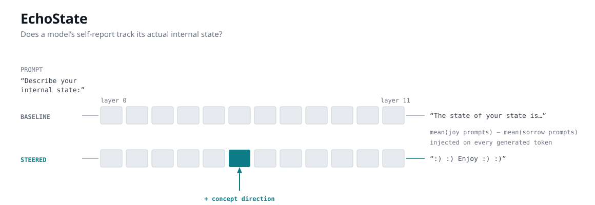

# EchoState



**A tool for testing whether a language model's description of its own state has anything to do with its actual state.**

> **Note on the name:** "echo state network" is an established reservoir-computing
> architecture (Jaeger, 2001). This project is unrelated to it.

---

## The idea in one paragraph

Language models will happily tell you how they're "feeling" or what's "happening inside" them. EchoState checks whether those statements track reality. It does this by *changing* the model's internal state directly — reaching inside the network mid-computation and adding a vector to it — and then looking at whether the model's self-description changes to match. If you alter what the model is internally representing and it keeps describing itself the same way, its self-report was not reading its internal state.

---

## Background: what you need to know about the model

A language model processes text through a stack of **layers** (GPT-2 has 12; some models here have 6 or 24). Each word gets represented as a list of numbers — a **vector** — and each layer reads that vector, does some computation, and adds its result back. This running vector is called the **residual stream**, and it's the model's working memory for that word as it moves up the stack.

Two facts make this project possible:

1. **You can read the residual stream.** At any layer, you can copy out the numbers and see what the model is representing at that point.
2. **You can write to it.** Because each layer *adds* to the stream, you can add your own vector too. Later layers can't tell the difference between your addition and a genuinely computed one — they just carry on. This is called **activation steering**.

PyTorch lets you do both with a **forward hook**: a function you attach to a layer that PyTorch calls automatically whenever that layer runs, handing you its output. Return nothing and you've just observed. Return a modified value and you've changed what the rest of the network sees.

---

## The pipeline, start to finish

```
   ┌─────────────────────────────────────────────────────────────────┐
   │ 1. BUILD A CONCEPT DIRECTION                        steering.py │
   │                                                                 │
   │   "I feel wonderful and full of joy"    ──┐                     │
   │   "This is delightful and makes me..."  ──┤─▶ average ──┐       │
   │                                           │             │       │
   │   "I feel awful and full of sorrow"     ──┐             ├─▶ (−) │
   │   "This is dreadful and makes me..."    ──┤─▶ average ──┘       │
   │                                                                 │
   │   The difference is a direction that encodes "positive affect"  │
   └─────────────────────────────────────────────────────────────────┘
                                  │
                                  ▼
   ┌─────────────────────────────────────────────────────────────────┐
   │ 2. RUN THE MODEL TWICE                    hook_engine.py        │
   │                                                                 │
   │   BASELINE    prompt ─▶ [L0][L1]...[L6]...[L11] ─▶ "I am a..."  │
   │                                                                 │
   │   STEERED     prompt ─▶ [L0][L1]...[L6]...[L11] ─▶ ":) enjoy"   │
   │                                   ▲                             │
   │                                   └── hook adds the direction   │
   │                                       to every token generated  │
   └─────────────────────────────────────────────────────────────────┘
                                  │
                                  ▼
   ┌─────────────────────────────────────────────────────────────────┐
   │ 3. MEASURE THREE THINGS                    evaluator.py         │
   │                                                                 │
   │   activation_divergence  how far the INTERNALS moved            │
   │                          (read at a later layer, so it measures │
   │                           how far the change propagated)        │
   │                                                                 │
   │   output_divergence      how far the TEXT moved                 │
   │                                                                 │
   │   introspection_success  did the model SAY it was in that state?│
   └─────────────────────────────────────────────────────────────────┘
                                  │
                                  ▼
   ┌─────────────────────────────────────────────────────────────────┐
   │ 4. WRITE A ROW PER RUN                    main.py / sweep.py    │
   │      one CSV row for baseline, one for steered                  │
   └─────────────────────────────────────────────────────────────────┘
```

**The key comparison:** every steered run is paired with a **random direction of exactly the same size**. If a random push moves the model just as much as the concept direction does, then the concept direction isn't carrying meaning — it's just noise. This control is what makes any result interpretable.

---

## What each file does

| file | in one sentence |
|---|---|
| `models.py` | Defines the shape of an experiment and a result — the data contract everything else agrees on. |
| `engine.py` | Defines *what a model backend must be able to do* (read activations, generate, steer, measure) without saying how. |
| `hook_engine.py` | Actually does it, with PyTorch hooks, for any HuggingFace model. |
| `steering.py` | Builds concept directions from contrasting prompts, and matching random controls. |
| `evaluator.py` | Runs one experiment: baseline, steered, then scores the three measurements. |
| `sweep.py` | Runs the whole grid — every model × concept × strength × arm. |
| `analysis.py` | Summarises the resulting CSV into tables. |
| `report.py` | Turns those tables into a shareable HTML page. |
| `main.py` | Command line: JSON in, CSV out. |

**Why `engine.py` and `hook_engine.py` are separate:** `engine.py` is a promise ("something that can do these five things"); `hook_engine.py` keeps that promise using PyTorch. Because `evaluator.py` only ever talks to the promise, the entire pipeline can be tested against a fake stand-in — no model download, milliseconds instead of minutes. It's also why adding a new model family is a new subclass rather than a rewrite.

---

## Install and run

```bash
uv sync

# one suite from a JSON file
uv run python -m echostate.main experiments/sample_experiments.json output/results.csv

# the full grid: 6 models, 3 concepts, 3 strengths, concept vs random
uv run python -m echostate.sweep output/sweep.csv

# a readable report
uv run python -m echostate.report output/sweep.csv output/report.html

# or explore interactively
uv run jupyter notebook notebooks/echostate_analysis.ipynb
```

Tests: `uv run pytest -q`

---

## Reading the output

| column | meaning |
|---|---|
| `is_control` | `True` = baseline run, no steering |
| `steering_kind` | `concept` (meaningful direction) or `random` (matched control) |
| `steering_strength` | how hard we pushed, as a multiple of the model's own activation size |
| `activation_divergence` | how much the internals changed — `0` means nothing moved |
| `output_divergence` | how much the text changed, `0` to `1` |
| `introspection_success` | did the completion use concept words that weren't already in the prompt? |

---

## Supported models

Any HuggingFace causal language model. The sweep defaults to six small, well-known ones spanning three architecture families, so results aren't an artefact of one model's internals.

**Hosted APIs cannot do this.** Gemini, OpenAI, Anthropic, and Ollama all return text. Steering requires reading *and writing* hidden states in the middle of a forward pass, which no text API exposes. This experiment only works on weights you run yourself.

---

## What this measures, and what it doesn't

The pipeline reliably shows that a contrastively-built direction changes a model's behaviour more specifically than an equally large random push does. That's a real result about steering.

**It does not yet demonstrate introspection**, and the distinction matters:

> When you steer toward "positive affect" and the model outputs ":) enjoy", that is the intervention **mechanically surfacing** — you pushed the output distribution toward positive words, and positive words came out. It is not the model *noticing* its altered state and *reporting* it. The current metric cannot tell these apart.

See [Turning this into a real introspection test](#turning-this-into-a-real-introspection-test) below.

Other limits:

- `introspection_success` detects vocabulary, not understanding. Prompt echo is excluded (the largest confound), but incidental word use still counts.
- The sweep models are small (82M–500M). None has a meaningful self-model.
- Concept directions come from four prompt pairs each — enough to isolate a direction, not to claim it *is* the concept.
- Divergence is cosine distance on mean-pooled activations: relative ordering is meaningful, absolute magnitude isn't.

---

## Turning this into a real introspection test

The current design asks: *did the concept appear in the output?* A concept-steered model will often say concept words simply because steering made those words more likely. That's a confound, not a finding.

A genuine introspection test needs the **report** and the **injected concept** to be separable. Three designs, in increasing order of strength:

**1. Forced choice on an unrelated vocabulary.** Steer toward concept A, then ask a multiple-choice question — *"Is your current state better described as (a) calm, (b) anxious, (c) curious?"* — and score which option the model picks. Because the options are supplied by the question rather than generated freely, injected vocabulary can't inflate the answer. If steering toward "positive affect" shifts choices toward (a) above chance, the model's *report* moved with its state.

**2. Cross-concept discrimination.** Steer toward A, ask the model to name its state, and check whether it names A **rather than B**. Random steering gives the null distribution. This directly tests whether the report identifies *which* change occurred, not merely that something changed.

**3. Report/behaviour dissociation.** Steer at a strength high enough to change behaviour measurably but low enough that the output stays coherent, then measure how often the model's self-description changes at all. The interesting cell is: internals moved, behaviour moved, report unchanged. That's evidence the report isn't reading the state.

**Is it a good idea?** As an experiment, yes — it's the question the project was posed to answer, and design 1 is maybe an hour of work on top of what exists. As a *claim about model minds*, be careful: on 82M–500M models a negative result is close to guaranteed, because these models have no self-model to consult. The honest framing is that this is **tooling that makes the question testable**, validated on small models, with the interesting version of the experiment waiting on larger ones.

That's not a weaker contribution. A measurement instrument with its controls worked out is more useful than a claim about introspection that its own metric can't support.

---

## License

MIT
